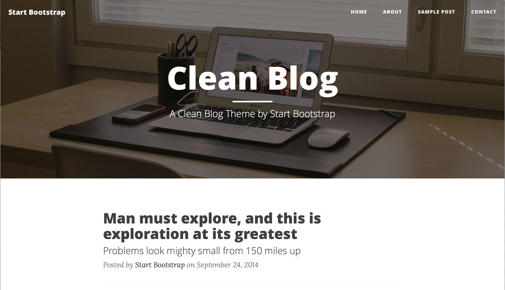
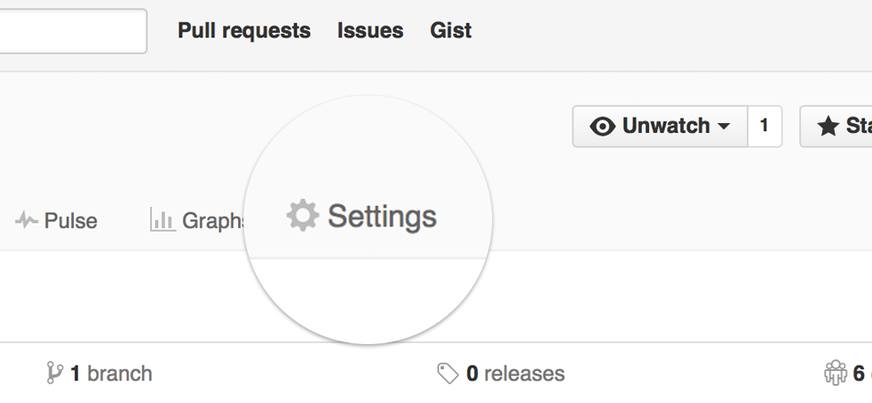
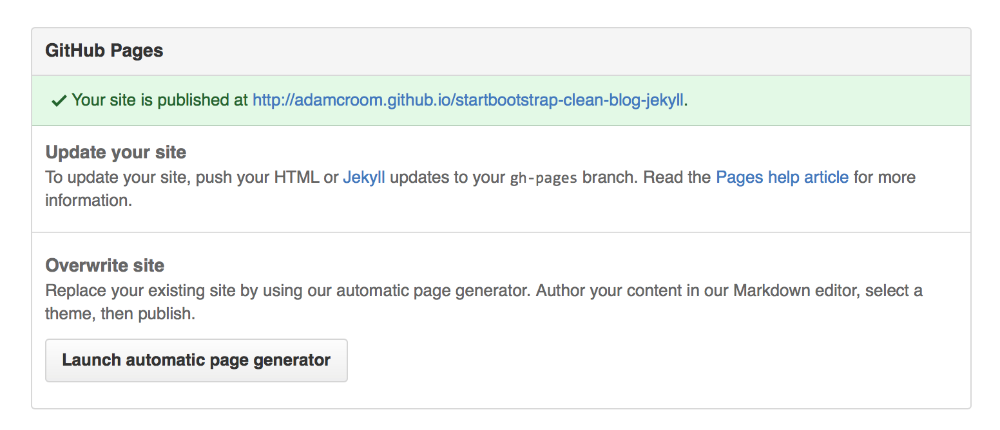
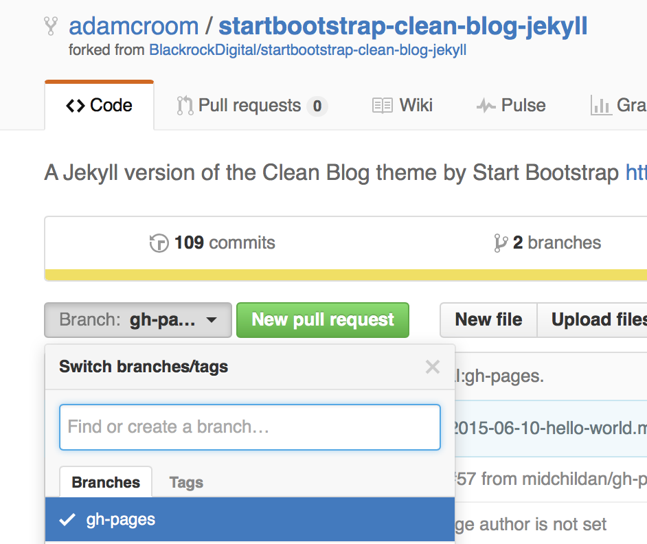
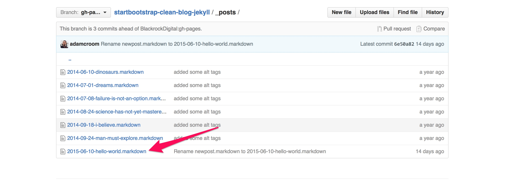
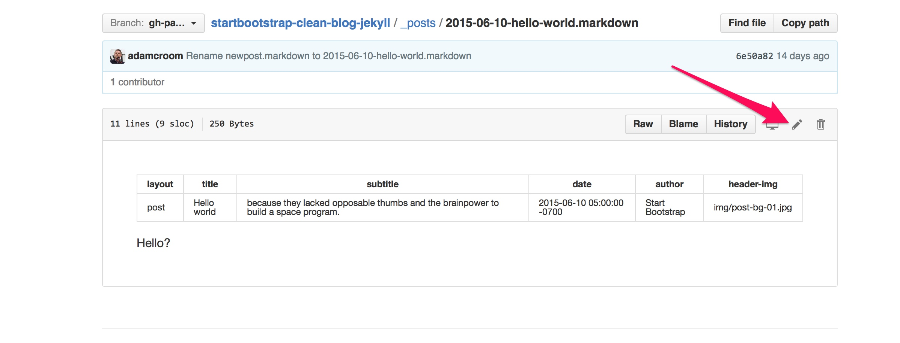
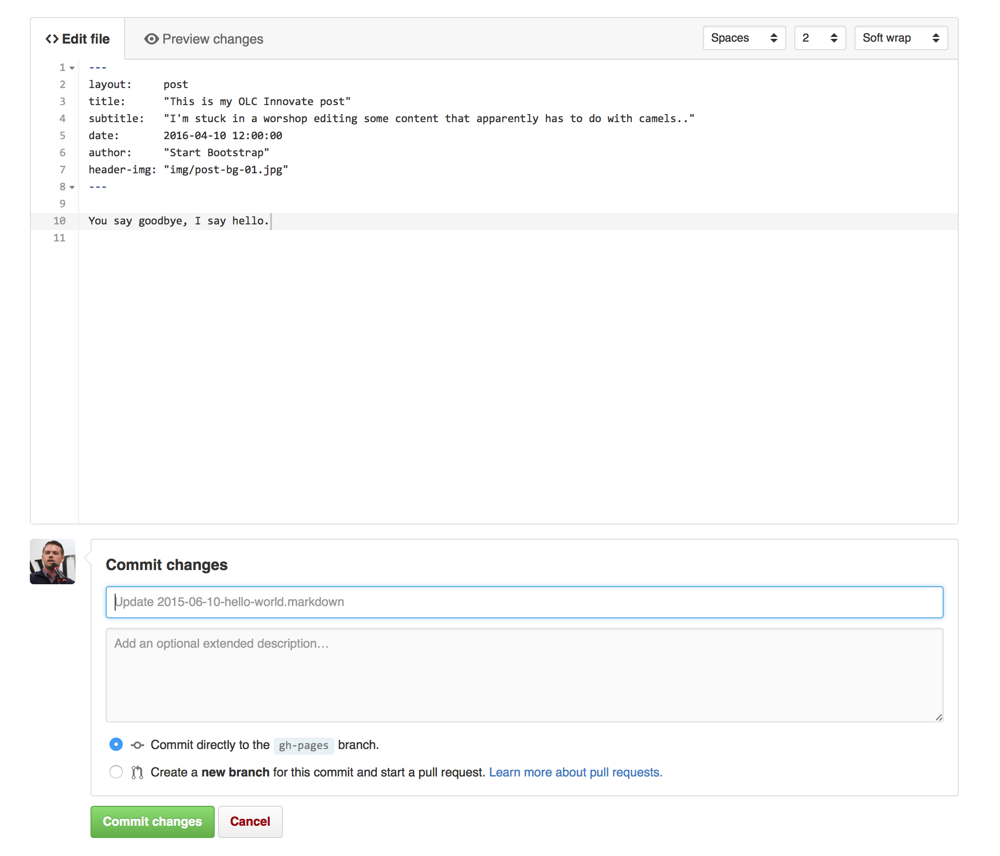
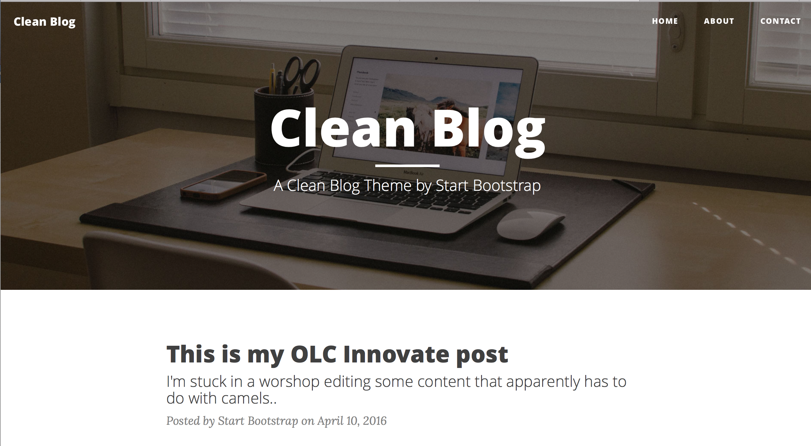

# Github Pages Projects

One of the affordances of Github Pages is that it can host static HTML webpages. Here are a couple different ways to quickly get a website up and running.

## Fork a website
Seriously. That's it. Fork another website. So let's fork this one called [Clean Blog](https://github.com/BlackrockDigital/startbootstrap-clean-blog-jekyll).



## Jekyll
This template uses a CMS called Jekyll, which generates static HTML pages. This means that to blog we won't have to write actual HTML, instead we will write in a Github flavor of Markdown. If necessary, feel free to use this [Markdown Cheatset](https://github.com/adam-p/markdown-here/wiki/Markdown-Here-Cheatsheet).

## Is this thing already live?!
Yes! To find your web address, click on Settings.



Now scroll down to the Github Pages section to see where your site has been published.



This is because Github automatically publishes repositories that have a special branch called "gh-pages." If you go back your repo home page, you'll notice gh-pages on the branches dropdown.



## How can I write a post?
Click on the folder in your repository labeled "_posts".


You'll find a set of posts already in there labeled in a format of YYYY-MM-DD-title-goes-here.markdown. Let's go ahead and edit one of them to see how this works. Click on the file label "2015-06-10-hello-world.markdown" and then click the pencil icon to edit the file.





What you see here is some formatting data at the top that looks like this:

```
---
layout:     post
title:      "Hello world"
subtitle:   "because they lacked opposable thumbs and the brainpower to build a space program."
date:       2015-06-10 12:00:00
author:     "Start Bootstrap"
header-img: "img/post-bg-01.jpg"
---
```

This is called YAML (yet another markup language). This theme has HTML templates that know to associate specific fields styling. For instance, it knows this is a post because the layout associated with it is "post." It also knows the title, subtitle, data, author, and header image. Play around with changing the title and subtitle as well as the date. 

*Warning: do not change the layout or it will no longer know that it's a post!

Similarly, add content your blog post by replacing "Hello?" located directly below the YAML content.

Once you are done, you'll want to Commit your change.



Now go back to Settings recover that link and you'll see the changes take place (you may need to refresh the page).


